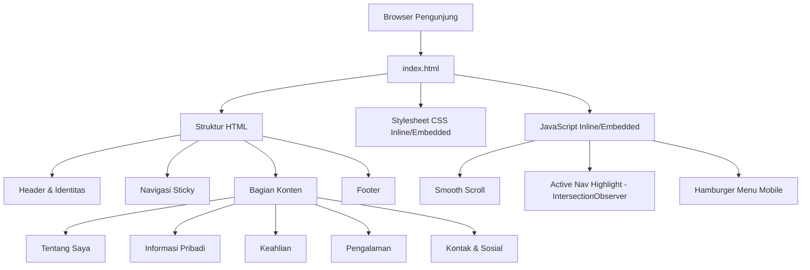

# Dokumen Desain: Website Profil Pribadi

## Ikhtisar

Website profil pribadi adalah halaman web statis satu halaman (single-page) yang dibangun menggunakan HTML, CSS, dan JavaScript murni — tanpa framework atau build tool eksternal. Halaman ini berfungsi sebagai kartu identitas digital yang menampilkan informasi pemilik secara terstruktur dan menarik.

Pendekatan single-page dipilih karena:
- Semua konten dapat dimuat sekaligus tanpa request tambahan
- Tidak memerlukan server-side rendering atau backend
- Mudah di-deploy ke hosting statis (GitHub Pages, Netlify, dll.)
- Performa optimal karena minimnya dependensi eksternal

Struktur halaman mengikuti pola vertikal dari atas ke bawah: header identitas → navigasi → konten bagian-bagian → footer. Navigasi sticky memungkinkan pengunjung berpindah antar bagian tanpa scroll panjang.

---

## Arsitektur

Website ini menggunakan arsitektur **statis satu file** dengan pemisahan logis antara struktur (HTML), presentasi (CSS), dan perilaku (JavaScript).



### Keputusan Arsitektur

| Keputusan | Pilihan | Alasan |
|---|---|---|
| Jumlah file | Satu file `index.html` | Deployment mudah, tidak perlu build step |
| CSS | Embedded `<style>` | Menghindari request HTTP tambahan |
| JavaScript | Embedded `<script>` | Menghindari request HTTP tambahan |
| Font | System font stack | Tidak ada request ke CDN eksternal |
| Ikon | Emoji Unicode | Tidak perlu library ikon eksternal |

---

## Komponen dan Antarmuka

### 1. Header Identitas (`<header>`)

Komponen paling atas halaman yang selalu terlihat saat halaman pertama dimuat.

**Elemen:**
- Cover/banner dekoratif (gradient CSS)
- Foto profil / avatar (elemen `` atau emoji fallback)
- Nama lengkap (`<h1>`)
- Jabatan/profesi (`<p>`)
- Lokasi (`<p>`)

**Perilaku:**
- Foto profil memiliki atribut `alt` deskriptif
- Seluruh konten header terlihat tanpa scroll pada viewport standar

---

### 2. Navigasi Sticky (`<nav>`)

Menu navigasi yang tetap terlihat saat pengguna menggulir halaman.

**Elemen:**
- Daftar tautan (`<ul>/<li>/<a>`) ke setiap section
- Tombol hamburger untuk mobile (`<button>`)
- Menu dropdown/overlay untuk mobile

**Perilaku:**
- `position: sticky; top: 0` agar selalu terlihat
- Klik tautan → smooth scroll ke section tujuan
- `IntersectionObserver` untuk mendeteksi section aktif dan menyorot item nav
- Di layar < 768px: menu hamburger toggle menampilkan/menyembunyikan daftar navigasi

**Antarmuka JavaScript:**
```javascript
// Inisialisasi smooth scroll
initSmoothScroll(navLinks)

// Inisialisasi active section observer
initActiveNavObserver(sections, navLinks)

// Toggle hamburger menu
toggleMobileMenu(menuButton, navList)
```

---

### 3. Bagian Tentang Saya (`<section id="tentang">`)

**Elemen:**
- Judul bagian (`<h2>`)
- Paragraf bio (`<p>`)

**Batasan konten:**
- Panjang teks: 50–1000 karakter
- Teks tidak boleh terpotong (CSS: `overflow: visible`, tidak ada `text-overflow: ellipsis`)

---

### 4. Bagian Informasi Pribadi (`<section id="informasi">`)

**Elemen:**
- Judul bagian (`<h2>`)
- Grid item informasi: label + nilai
- Item wajib: nama lengkap, email, lokasi
- Item opsional: telepon, tanggal lahir, status

**Perilaku:**
- Item opsional yang tidak diisi disembunyikan (`display: none` atau tidak di-render)
- Tata letak grid 2 kolom di desktop, 1 kolom di mobile

---

### 5. Bagian Keahlian (`<section id="keahlian">`)

**Elemen:**
- Judul bagian (`<h2>`)
- Container flex-wrap untuk tag keahlian
- Setiap keahlian sebagai `<span class="skill-tag">`

**Perilaku:**
- `display: flex; flex-wrap: wrap` agar tag melingkar ke baris berikutnya
- Tidak ada overflow tersembunyi

---

### 6. Bagian Pengalaman (`<section id="pengalaman">`)

**Elemen:**
- Judul bagian (`<h2>`)
- Daftar entri pengalaman (timeline vertikal)
- Setiap entri: nama posisi, nama perusahaan/lembaga, periode waktu

**Perilaku:**
- Entri diurutkan dari terbaru ke terlama (urutan dalam HTML)
- Indikator visual (titik/garis) untuk tampilan timeline

---

### 7. Bagian Kontak & Sosial (`<section id="kontak">`)

**Elemen:**
- Judul bagian (`<h2>`)
- Tombol/tautan email (`<a href="mailto:...">`)
- Tombol/tautan sosial eksternal (`<a href="..." target="_blank" rel="noopener noreferrer">`)

**Perilaku:**
- Tautan email membuka aplikasi email default via `mailto:`
- Tautan eksternal dibuka di tab baru (`target="_blank"`)
- Tombol platform yang tidak tersedia disembunyikan (tidak di-render atau `display: none`)
- Atribut `rel="noopener noreferrer"` untuk keamanan

---

### 8. Footer (`<footer>`)

**Elemen:**
- Teks hak cipta dengan nama pemilik dan tahun

---

## Model Data

Karena website ini statis, tidak ada database. "Data" disimpan langsung dalam HTML sebagai konten hardcoded. Berikut adalah model konseptual data yang direpresentasikan:

### ProfilPemilik

```
ProfilPemilik {
  namaLengkap: string          // wajib, ditampilkan di header dan info pribadi
  jabatan: string              // wajib, ditampilkan di header
  lokasi: string               // wajib, ditampilkan di header dan info pribadi
  fotoProfil: string | null    // URL gambar atau null (gunakan avatar emoji)
  altFoto: string              // teks alt deskriptif untuk foto profil
  email: string                // wajib, digunakan di info pribadi dan kontak
  telepon: string | null       // opsional
  tanggalLahir: string | null  // opsional
  statusKetersediaan: string | null // opsional (misal: "Tersedia untuk Hire")
  bio: string                  // wajib, 50–1000 karakter
}
```

### Keahlian

```
Keahlian {
  nama: string    // nama skill/teknologi yang ditampilkan sebagai tag
}
```

### EntriPengalaman

```
EntriPengalaman {
  posisi: string        // nama jabatan atau program studi
  institusi: string     // nama perusahaan atau lembaga pendidikan
  periode: string       // rentang waktu, misal "Jan 2022 – Sekarang"
  urutan: number        // urutan tampil (0 = terbaru)
}
```

### TautanSosial

```
TautanSosial {
  platform: string      // "email" | "linkedin" | "github" | dll.
  url: string           // URL lengkap atau "mailto:..." untuk email
  label: string         // teks tombol
  tersedia: boolean     // jika false, tombol disembunyikan
}
```

---

## Properti Kebenaran (Correctness Properties)

*Properti adalah karakteristik atau perilaku yang harus berlaku di semua eksekusi sistem yang valid — pada dasarnya, pernyataan formal tentang apa yang seharusnya dilakukan sistem. Properti berfungsi sebagai jembatan antara spesifikasi yang dapat dibaca manusia dan jaminan kebenaran yang dapat diverifikasi secara otomatis.*


### Properti 1: Validasi Panjang Bio

*Untuk setiap* string teks bio, fungsi validasi SHALL menerima string dengan panjang antara 50 hingga 1000 karakter, dan menolak string di luar rentang tersebut.

**Memvalidasi: Persyaratan 2.2**

---

### Properti 2: Teks Bio Ditampilkan Lengkap

*Untuk setiap* teks bio yang valid (50–1000 karakter), panjang teks yang dirender di DOM SHALL sama dengan panjang teks input — tidak ada karakter yang terpotong atau disembunyikan.

**Memvalidasi: Persyaratan 2.3**

---

### Properti 3: Konsistensi Rendering Item Informasi

*Untuk setiap* item informasi (baik wajib maupun opsional) yang ditampilkan, elemen yang dirender SHALL memiliki elemen label yang tidak kosong dan elemen nilai yang tidak kosong, dengan struktur HTML yang identik untuk semua item.

**Memvalidasi: Persyaratan 3.2, 3.3**

---

### Properti 4: Setiap Keahlian Dirender Sebagai Elemen Terpisah

*Untuk setiap* daftar keahlian dengan N item, jumlah elemen tag keahlian yang dirender di DOM SHALL sama dengan N — tidak ada keahlian yang hilang atau digabung.

**Memvalidasi: Persyaratan 4.2**

---

### Properti 5: Kelengkapan Data Entri Pengalaman

*Untuk setiap* entri pengalaman yang dirender, elemen yang dihasilkan SHALL mengandung teks untuk nama posisi, nama institusi/perusahaan, dan periode waktu — tidak ada field yang kosong atau hilang.

**Memvalidasi: Persyaratan 5.2**

---

### Properti 6: Urutan Pengalaman Terbaru ke Terlama

*Untuk setiap* daftar entri pengalaman dengan urutan yang ditentukan, posisi DOM dari setiap entri SHALL mencerminkan urutan dari nilai `urutan` terkecil (terbaru) ke terbesar (terlama).

**Memvalidasi: Persyaratan 5.3**

---

### Properti 7: Format Tautan Email

*Untuk setiap* alamat email yang valid, atribut `href` pada tombol email SHALL memiliki nilai `mailto:{email}` yang tepat — memastikan klik membuka aplikasi email dengan alamat tujuan yang sudah terisi.

**Memvalidasi: Persyaratan 6.3**

---

### Properti 8: Perilaku Tautan Sosial

*Untuk setiap* daftar tautan sosial dengan kombinasi tersedia/tidak tersedia, (a) hanya tautan yang `tersedia = true` yang dirender di DOM, dan (b) setiap tautan eksternal yang dirender SHALL memiliki atribut `target="_blank"` dan `rel="noopener noreferrer"`.

**Memvalidasi: Persyaratan 6.4, 6.5**

---

### Properti 9: Tidak Ada Overflow Horizontal di Semua Viewport

*Untuk setiap* lebar viewport dalam rentang 320px hingga 1920px, tidak ada elemen di halaman yang SHALL memiliki lebar yang melebihi lebar viewport (tidak ada overflow horizontal).

**Memvalidasi: Persyaratan 8.1, 8.4**

---

### Properti 10: Tata Letak Satu Kolom di Mobile

*Untuk setiap* lebar viewport antara 320px dan 767px, grid informasi pribadi SHALL menggunakan tata letak satu kolom (grid-template-columns: 1fr atau setara).

**Memvalidasi: Persyaratan 8.2**

---

### Properti 11: Atribut Alt pada Semua Gambar

*Untuk setiap* elemen `` yang ada di halaman, atribut `alt` SHALL ada dan tidak boleh kosong (string kosong atau tidak ada atribut sama sekali tidak diperbolehkan).

**Memvalidasi: Persyaratan 9.3**

---

## Penanganan Error

Karena website ini adalah halaman statis tanpa input pengguna secara langsung (konten di-hardcode), skenario error yang perlu ditangani bersifat defensif:

### Gambar Gagal Dimuat

**Kondisi:** Atribut `src` pada `` foto profil mengarah ke URL yang tidak valid atau file tidak ditemukan.

**Penanganan:**
- Gunakan event handler `onerror` pada elemen `` untuk mengganti gambar dengan avatar emoji fallback
- Contoh: ``
- Elemen avatar emoji disembunyikan secara default dan ditampilkan saat gambar gagal

### Tautan Sosial Tidak Tersedia

**Kondisi:** Platform sosial tertentu tidak memiliki URL yang dikonfigurasi.

**Penanganan:**
- Tombol platform yang tidak tersedia tidak dirender (atau diberi `display: none`)
- Tidak ada pesan error yang ditampilkan kepada pengunjung

### Konten Terlalu Panjang

**Kondisi:** Teks bio atau nama yang sangat panjang dapat merusak tata letak.

**Penanganan:**
- Bio: Batasi input ke 1000 karakter (validasi sisi konten)
- Nama/jabatan panjang: Gunakan `word-break: break-word` pada elemen teks
- Keahlian dengan nama panjang: Tag menggunakan `max-width` dengan `overflow: hidden; text-overflow: ellipsis`

### Viewport Sangat Kecil (< 320px)

**Kondisi:** Perangkat dengan lebar layar di bawah 320px.

**Penanganan:**
- Tata letak tetap fungsional dengan `min-width: 320px` pada container utama
- Konten dapat di-scroll secara horizontal jika diperlukan (tidak diblokir)

---

## Strategi Pengujian

### Pendekatan Pengujian Ganda

Website profil pribadi ini menggunakan kombinasi **pengujian berbasis contoh** dan **pengujian berbasis properti** untuk cakupan yang komprehensif.

### Pengujian Berbasis Contoh (Unit Tests)

Digunakan untuk memverifikasi perilaku spesifik dan kondisi yang tidak bervariasi dengan input:

| Tes | Persyaratan |
|---|---|
| Header menampilkan nama, foto, jabatan, lokasi | 1.1–1.4 |
| Header terlihat tanpa scroll (above the fold) | 1.5 |
| Section "Tentang Saya" ada dan berisi teks | 2.1 |
| Section informasi pribadi memiliki field wajib | 3.1 |
| Section keahlian ada dan berisi tag | 4.1 |
| Section pengalaman ada dan berisi entri | 5.1 |
| Section kontak ada dan berisi metode kontak | 6.1 |
| Tautan sosial dirender sebagai elemen `<a>` | 6.2 |
| Nav ada dan berisi tautan ke semua section | 7.1 |
| Tautan nav memiliki href yang sesuai dengan ID section | 7.2 |
| Fungsi highlight nav menambahkan class aktif yang benar | 7.3 |
| Tombol hamburger terlihat di mobile, menu tersembunyi default | 8.3 |
| Elemen semantik HTML ada (`<header>`, `<main>`, `<section>`, `<footer>`, `<nav>`) | 9.2 |

### Pengujian Berbasis Properti (Property-Based Tests)

Library yang digunakan: **[fast-check](https://github.com/dubzzz/fast-check)** (JavaScript)

Setiap tes properti dikonfigurasi untuk berjalan minimal **100 iterasi**.

Format tag: `Feature: personal-profile-website, Property {nomor}: {teks properti}`

| Properti | Implementasi |
|---|---|
| Properti 1: Validasi panjang bio | Generate string dengan panjang acak, verifikasi fungsi `validateBio(text)` |
| Properti 2: Teks bio tidak terpotong | Generate bio valid, render, verifikasi `textContent.length === input.length` |
| Properti 3: Konsistensi rendering item info | Generate item info acak, render, verifikasi struktur label+nilai |
| Properti 4: Jumlah tag keahlian | Generate array keahlian acak, render, verifikasi `querySelectorAll('.skill-tag').length === input.length` |
| Properti 5: Kelengkapan entri pengalaman | Generate entri acak, render, verifikasi keberadaan posisi, institusi, periode |
| Properti 6: Urutan pengalaman | Generate entri dengan urutan acak, render, verifikasi urutan DOM |
| Properti 7: Format mailto | Generate email acak, render, verifikasi `href === "mailto:" + email` |
| Properti 8: Perilaku tautan sosial | Generate kombinasi tersedia/tidak tersedia, render, verifikasi jumlah dan atribut |
| Properti 9: Tidak ada overflow horizontal | Generate lebar viewport acak 320-1920px, render, verifikasi tidak ada overflow |
| Properti 10: Tata letak satu kolom mobile | Generate lebar viewport acak 320-767px, render, verifikasi grid satu kolom |
| Properti 11: Atribut alt gambar | Generate halaman dengan berbagai jumlah gambar, verifikasi semua `` memiliki alt |

### Pengujian Smoke

- Waktu muat halaman < 3 detik (Persyaratan 9.1)
- Kontras warna memenuhi WCAG AA menggunakan axe-core (Persyaratan 9.4)

### Pengujian Aksesibilitas

- Jalankan axe-core atau Lighthouse untuk audit aksesibilitas otomatis
- Pengujian manual dengan screen reader (NVDA/VoiceOver) untuk navigasi keyboard
- Catatan: Validasi WCAG penuh memerlukan pengujian manual dengan teknologi asistif dan tinjauan ahli aksesibilitas

### Lingkungan Pengujian

- **Framework**: Jest + jsdom untuk unit test dan property test
- **Property-based testing**: fast-check (minimum 100 iterasi per properti)
- **Aksesibilitas**: axe-core
- **Browser testing**: Chrome, Firefox, Safari (manual atau Playwright)
